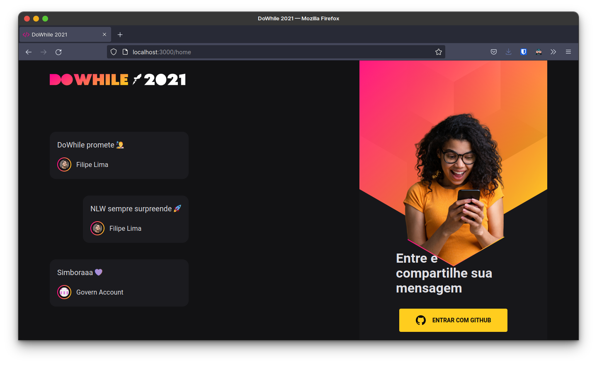

<h1 align="center">
NLW Heat - React
</h1>

The web frontend of a chat app that was created at NLW Heat event.

Deployed <a href="https://nlw-react.vercel.app">here</a>.

<h2 align="center">
Home Screen
</h2>

  

Other screenshots at [REVIEW.md](./REVIEW.md)

## Techs

- [x] React
- [x] Vite
- [x] Sass

## Usage

1. Run `npm install` or `yarn install`. 
2. Run `yarn dev` and access `http://localhost:3000`. 
